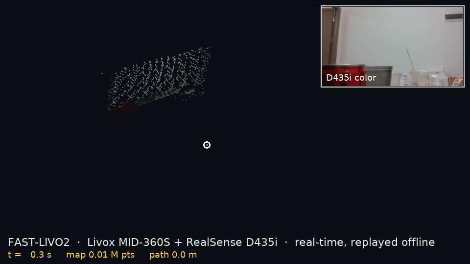
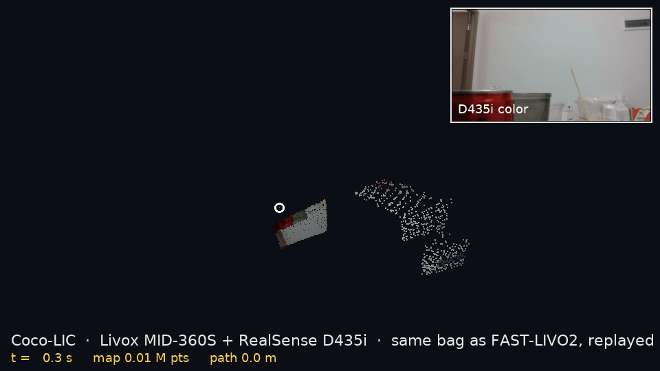

# LiDAR-Camera-IMU Calibration

**LiDAR-Camera-IMU Calibration 是一套开源的一站式多传感器标定与
部署工作台，覆盖相机、IMU、LiDAR 及跨传感器时空参数。文档中的
D435i/MID-360S rig 已包含相机标定、MID-360S IMU 标定、LiDAR–Camera 与
LiDAR–IMU 几何、跨设备时间对齐、扫描 deskew、MID-360S 原生查看、
单画布点云融合和 ROS 2 校正 IMU 运行时。**

[English README](README.md) · 完整实录 [CALIBRATION.md](CALIBRATION.md) ·
误差影响分析 [IMPACT_ANALYSIS.md](IMPACT_ANALYSIS.md)

标定这行最怕的不是误差大，是**看起来漂亮但错得一致**。本工作台
把拟合指标与物理参照、重复采集、device/mount 身份一起固结，并把适用的
证据层级直接写在结果旁边。CLI、报告、GUI 与实时融合查看器共用同一份事实。


## 已交付能力

**D435i 标定**：RGB 内参 → IR 双目 → RGB↔IR 外参 → 深度噪声模型 →
cam-IMU → 加速度计内参 → 温漂模型，并配套采集/标定工具、GUI 和工程实践记录。

**声明式判决层**：26 条规则通过同一引擎驱动 CLI、`REPORT.md` 和 GUI 卡片；
新设备通过增加规则接入，无需分叉判决代码。

**D435i/MID-360S rig**：viewer 可直接渲染任意 ROS 2
`sensor_msgs/msg/PointCloud2` 与 Livox `CustomMsg`；直接雷视流程从采集、
求解到导入全链打通；D435i/MID-360S 实时点云在同一彩色相机坐标系
画布中融合。文档 rig 已固结 MID-360S IMU 标定、五场景雷视外参、
LiDAR–IMU 几何和雷达到 D435i 的常数时偏；逐点 `offset_time` 与 200 Hz
内置陀螺仪驱动带已知 IMU 杠杆臂的扫描末旋转 deskew。

## 实测雷视一体 rig

<table>
  <tr>
    <td align="center" valign="top" width="280">
      <br>
      <sub>MID-360S + D435i 刚性组装</sub>
    </td>
    <td align="center" valign="top" width="280">
      <br>
      <sub>通电采集与接线</sub>
    </td>
    <td align="center" valign="top" width="280">
      <br>
      <sub>Intel RealSense D435i</sub>
    </td>
    <td align="center" valign="top" width="280">
      <br>
      <sub>DFOPTIX 刚性 AprilGrid 标定板</sub>
    </td>
  </tr>
</table>
<p align="center"><sub>← 左右滑动或滚动查看完整硬件 →</sub></p>

本 rig 使用 Intel RealSense D435i（fw 5.12.7.100，USB 3.2）与 DFOPTIX
`Tag6-320-35.2mm` 刚性 AprilGrid。成品靶标排除了打印缩放误差源；
`tagSpacing = 0.3` 经尺子实测 10.6 mm 白缝、型号、Kalibr 默认值和
重投影误差扫描四重确认。

## MID-360S IMU 端到端 pipeline 与 ROS 2 部署

一个 fail-closed 入口已连通：device/mount 预检→自动多姿态静置采集
（或复用 rosbag2/NPZ）→明确的 `g × 9.80665` 单位转换→解算→
独立 holdout/可观测性验收→正式结果 promotion→GUI 目录回归：

```bash
# 在线：从 /livox/imu 自动收集 12 fit + 3 holdout 姿态。
./calibrate_mid360s_imu.sh --project-root /path/to/your_rig_workspace

# 确定性回放本文档 rig 的已验收结果。
./calibrate_mid360s_imu.sh --verify-existing --inputs \
  data/mid360s_imu_intrinsic_20260901_run1 \
  data/mid360s_imu_intrinsic_20260901_run2 \
  data/mid360s_imu_intrinsic_20260901_run3
```

仓库同时是可安装的 ROS 2 包。source ROS 2 Jazzy 后：

```bash
colcon build --symlink-install --packages-select rgbd_fullcalib
source install/setup.bash
ros2 launch rgbd_fullcalib mid360s_imu_calibration.launch.py \
  project_root:=/absolute/path/to/artifact-root \
  config_file:=/absolute/path/to/mid360s_imu_calibration.yaml
ros2 launch rgbd_fullcalib mid360s_imu_runtime.launch.py \
  project_root:=/absolute/path/to/artifact-root \
  config_file:=/absolute/path/to/mid360s_imu_calibration.yaml
```

运行时节点订阅 raw `/livox/imu`，应用已验收的 accel bias/scale/非正交
与 gyro 静态 bias，在 `/livox/imu_calibrated` 发布 SI 观测。topic、frame、
身份、路径与输出均在
[`config/mid360s_imu_calibration.yaml`](config/mid360s_imu_calibration.yaml)
中参数化。

本 rig 实际打印的两件式支架也已原样收入：
[`3MF 文件`](hardware/MID360S_D435i_RK3588S_BATTERY_REV6_A1_PLA_4W15.3mf)
与[几何/安装方向说明](hardware/README.md)。ROS 安装后位于
`share/rgbd_fullcalib/hardware`。

## 结果速览

| 结果卡 | 关键数字 | 判决 |
|---|---|---|
| RGB 内参 | fx/fy 884.8/883.9，重投影 σ 0.56 px | ✅ 冻结 |
| IR 双目 | 基线 50.148 mm，与出厂值差 0.16% | ✅ 冻结 |
| 深度噪声 | 1/2/4 m 处 σ = 4.1/16.3/65 mm | ✅ 用作权重 |
| cam–IMU | 时移 4.0494 ms，旋转约 1° 量级 | ✅ 冻结旋转与时移 |
| RGB↔IR 外参 | 与出厂值的 \|t\| 差 0.023 mm | ✅ 冻结 |
| 加速度计内参 | 最大非正交 2.83°，12 姿态残差 3.76 mm/s² | ✅ 使用 |
| 温漂模型 | 深度尺度 −372 ppm/°C | ✅ 补偿深度尺度 |
| MID-360S IMU | accel bias `[−0.01745,+0.02770,−0.01560]` m/s²；scale `[0.999665,1.006801,1.007030]`；非正交 `[−0.002235,+0.001770,−0.003168]` rad | ✅ 当前 rig operational |
| MID-360S→D435i 外参 | 五场景，inlier median/P90 10.0/16.9 mm | ✅ 当前 rig operational |
| MID-360S LiDAR–IMU + deskew | 轴向同基，IMU `[+11.00,+23.29,−44.12]` mm；高旋转平面 P95 70.04→20.39 mm | ✅ 当前 rig operational |
| MID-360S→D435i 时间 | dual-gyro 时偏 −1.940 ms；`t_depth = t_livox − 5.989 ms` | ✅ 当前 rig 常数时偏 operational |

GUI 与结果 API 显示 **11 项本 rig 结果**，并另设 **7 项「标定参考」**
供其他设备与部署条件复用。

机器可读结果在 [`data/*.yaml`](data) 与 [`results/*.json`](results)；
雷视时偏、MID-360S IMU、LiDAR–IMU 与 deskew 验收分别固结于
[`results/mid360s_d435i_timesync.json`](results/mid360s_d435i_timesync.json)、
[`results/mid360s_imu.json`](results/mid360s_imu.json)、
[`results/mid360s_lidar_imu.json`](results/mid360s_lidar_imu.json) 和
[`results/mid360s_deskew_validation.json`](results/mid360s_deskew_validation.json)。
实扫验证的逐点时间有效率为 100%；同点 ablation 加入已标定杠杆臂
分量后 P95 从 20.21 降到 19.48 mm（组中位约
3.6%，paired median 约 2.8%）。

MID-360S IMU 结果还固结 gyro bias
`[−0.006402,+0.000822,−0.008318] rad/s`，以及 196.156 Hz、0.496 s 窗的逐轴
短窗白噪声密度：accel `[0.004974,0.005405,0.006853] m/s²/√Hz`，gyro
`[0.001421,0.001216,0.001749] rad/s/√Hz`。运行时使用实测加速度计模型与
陀螺静态 bias。
雷视外参属于文档中的刚性安装；其他 rig 或重新拆装后通过同一
流程生成自己的外参。

## 已验证适用范围

每项发布结果都与传感器和刚性安装身份绑定。运行时仅应用通过可观测性、
重复性与 holdout 验收的参数；完整对照实验与部署决策收录于
[CALIBRATION.md](CALIBRATION.md)。

## 下游验证：FAST-LIVO2 实时建图



本仓库发布的外参、时间偏移和内参**原样**喂给了 [FAST-LIVO2](https://github.com/hku-mars/FAST-LIVO2)，
同一套 rig、同一次安装（2026-09-19）：`T_camera_lidar` → `Rcl/Pcl`，`T_lidar_imu` → `extrinsic_T/R`，
雷达→深度时间偏移取反得到 `img_time_offset = +5.989 ms`，相机用出厂 1280×720 RGB 内参。
103 s 手持绕行（路径 27.0 m，约 2×3 m 房间）全程离起点不超过 2.1 m，LIO 内点比例中位 86 %，
点到面残差中位 0.019 m。同一份录制离线回放三次（1×、3×、1× 并开 rviz + 同时录包），轨迹一致到 0.15 m 以内。
证据与每个被消费的字段见 [`results/fastlivo2_downstream_validation.json`](results/fastlivo2_downstream_validation.json)。
这是同一 rig / 同一安装会话上的功能性验证，不构成独立的精度层级。

## 下游验证 2：同一份录制跑 Coco-LIC



同一套标定接着喂给了结构完全不同的第二个估计器：[Coco-LIC](https://github.com/APRIL-ZJU/Coco-LIC)
（连续时间 B 样条的雷达-惯性-相机里程计，经其 [ROS 2 Jazzy 移植](https://github.com/KaiFeng-Frank/Coco-LIC-ROS2-Jazzy) 运行），
输入是与 FAST-LIVO2 完全相同的 105 s 录制（`sha256 22c204e5…`，转成 rosbag2）。Coco-LIC 直接参数化相机→IMU，
所以用发布的两个矩阵复合出 `T_camera_lidar · T_lidar_imu`；`img_time_offset` 和 1280×720 内参与 FAST-LIVO2 用的是同一组数。
两个估计器的回环终点都落在离起点 1.45–1.46 m。把两条轨迹按时间关联（1376 对里关联上 1370，≤ 20 ms）、只对齐 yaw 和平移
（两者世界系不同）后，位置差 RMSE 0.15 m（中位 0.09 m）；最大 0.76 m 集中在靠窗的一段 10 s 里。只用雷达+IMU 的 Coco-LIC 为 0.135 m。
没有真值，这些是**互证一致性**数字，不是精度。用复合外参把相机图像重投影回 Coco-LIC 自己的地图，225 万点里 95 % 被上色且没有跨几何边界的颜色拖影。
证据见 [`results/cocolic_downstream_validation.json`](results/cocolic_downstream_validation.json)。

## 工程实践

15+ 条实测工程记录收录于 [CALIBRATION.md](CALIBRATION.md)，
摘要见 [English README](README.md#engineering-notes)。

## 声明式判决引擎


```bash
python -m verdicts                      # 终端判决
python -m verdicts --md REPORT.md       # Markdown 报告(已入库)
```

已发布的 26 条核查均位于
[`verdicts/rules_d435i.yaml`](verdicts/rules_d435i.yaml)，每条 =
{取值表达式, 外部参照, 容差, 行动指令},由 ~200 行引擎执行,CLI 报告、
REPORT.md、GUI 卡片同一事实源，并统一检查已发布产物的完整性。
新设备通过增加规则接入，无需分叉判决代码。

规则将两次独立 bag 采集的基线标定与 cam–IMU 输出中继承的相机链数值
明确区分；独立复测差值为 0.005 mm。

## GUI

WebGL2 点云查看器,三页签:实时点云(16-bit 深度图在 shader 内反投影,
或原生 xyz/intensity/RGB 点流走 VBO)、
标定结果(判决卡片,直接从 yaml/json 生成;每张卡带两枚 SLAM 徽章:**能否在线标定**
(外参旋转/时移/IMU 零偏是 VINS 类系统的标准在线状态,内参与深度链不是)与
**对 SLAM 影响定级**,每一级背后是实测传播数字)、标定参考(七项可复用方法：
四项 D435i + 三项 LiDAR/rig 参考，含适用场景/流程/输出)。第三页将这七项
复用方法与文档 rig 的 11 项结果分栏展示。温漂补偿一个勾选框直接作用到实时点云。


```bash
./view_pointcloud.sh fused                     # 同一坐标系、同一画布
./view_pointcloud.sh mid360                    # 复用已有驱动,或自动启动 MID-360S
./view_pointcloud.sh ros2 /your/points         # 任意 PointCloud2 话题
./view_pointcloud.sh ros2 auto                 # 只有一个候选时自动选择
./view_pointcloud.sh d435i --alt-emitter       # D435i 直连
./view_pointcloud.sh synthetic-points          # 无硬件原生点流回归
```

`fused` 把两路实时输入变换到同一个
`camera_color_optical_frame` 画布。文档 rig 的
[雷视外参](results/mid360s_d435i_extrinsic.local.json)、
[时间对齐](results/mid360s_d435i_timesync.json) 与
[LiDAR–IMU 几何](results/mid360s_lidar_imu.json) 自动载入；其他 rig 用
`--extrinsic PATH` 指定自己的相机外参。Livox `CustomMsg` 使用每点
`offset_time`、内置 IMU 与已知 IMU 杠杆臂执行已验证的扫描末旋转 deskew。
[通用雷视外参流程](docs/LIDAR_CAMERA_EXTRINSIC.md)已覆盖采集、求解、
结果方向、导入与融合查看。

统一入口打开 `http://localhost:8080`，隔离 ROS Jazzy 与 Conda，
任一实时流断开时会同步停止两个后端。ROS 2 点云按消息 frame
渲染当前帧。

## 关键文件

- `calibrate_mid360s_imu.sh`：MID-360S IMU 采集→解算→holdout→promotion
  端到端入口。
- `launch/mid360s_imu_calibration.launch.py`：ROS 2 标定 pipeline 入口。
- `launch/mid360s_imu_runtime.launch.py`：ROS 2 校正 IMU 运行时部署。
- `tools/record_mid360s_imu_poses.py`：自动多姿态静置采集。
- `tools/calibrate_mid360s_imu_intrinsics.py`：rosbag2/NPZ 解算与可观测性验收。
- `tools/promote_mid360s_imu.py`：严格绑定 current-rig 的正式结果边界。
- `tools/mid360s_imu_runtime.py`：raw g 输入到校正 SI IMU 话题。
- `tools/calibrate_lidar_camera_timesync.py`：dual-gyro 常数时偏拟合。
- `viewer/livox_deskew.py`：逐点扫描末旋转 deskew 与 IMU 杠杆臂。
- `results/mid360s_d435i_timesync.json`：雷视时间方程与常数时偏。
- `results/mid360s_imu.json`：MID-360S IMU operational 内参与短窗白噪声。
- `results/mid360s_lidar_imu.json`：`T_lidar_imu` 与 deskew 结果。
- `results/mid360s_deskew_validation.json`：实扫 deskew A/B 验收。
- `hardware/MID360S_D435i_RK3588S_BATTERY_REV6_A1_PLA_4W15.3mf`：实际
  两件式打印支架。

## 在你自己的 D435i 上复现

1. `pip install -r requirements.txt`(Python ≥3.10,**不需要装 ROS**)
2. 构建 Kalibr 镜像:先把 [ethz-asl/kalibr](https://github.com/ethz-asl/kalibr)
   clone 到 `kalibr/`,然后 `docker build -t kalibr:noetic -f kalibr/Dockerfile_ros1_20_04 kalibr/`
3. 打印 AprilGrid,**用尺子实测** tag 尺寸和间距,改 yaml
4. 采集 → 标定 → **先看判决行再决定信不信** —— 每个阶段的确切命令在
   [CALIBRATION.md](CALIBRATION.md) 末尾「复现」章

注意:本仓库数字来自一台 fw 5.12.7.100 的 D435i(USB 3.2)。你的机器数字**一定**
不同 —— 这正是要标定的原因。

## 为什么连"影响"也发

[IMPACT_ANALYSIS.md](IMPACT_ANALYSIS.md) 把每项实测误差传播到建图/定位量级
(含 Mid-360 雷视对照列),组织原则只有一条:把误差分成 零均值随机 / 恒定系统性 /
**状态依赖系统性** —— 第三类毁地图(温漂深度尺度拼出双层墙),第二类静默卡死
图内定位。它还按实测影响排定标定优先级:只标你的应用真正感觉得到的量,能省几天。

## License

MIT — 见 [LICENSE](LICENSE)。
